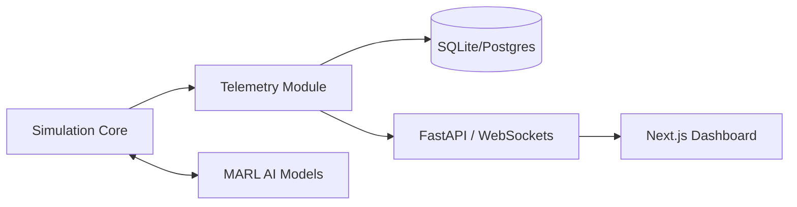

# Neon Gridiron: ULTRA Architecture 🏗️

## 1. Data Flow

## 2. Core Components

### 2.1 Simulation Layer (`/sim`)
- **Core State**: Atomic representation of the pitch.
- **Referee**: Logic for fouls, cards, and advantage.
- **Determinism**: Seeded PRNG and fixed-tick stepping.

### 2.2 Intelligence Layer (`/ai`)
- **Hierarchical Policy**:
    - *Coach*: Strategic intent vector (e.g., "All-out Attack").
    - *Players*: Intent-conditioned local policy.
- **World Model**: Latent representation for future-state prediction and planning.
- **League Manager**: Handles PBT, model mutations, and the Elo-ladder.

### 2.3 UI & Presentation (`/ui`, `/server`)
- **Live Sync**: Low-latency WebSocket streaming of game state.
- **Replay Library**: Loading and visualizing past match frames.
- **Explainability**: Annotating the UI with AI "Reason Codes".

## 3. Security & Stability
- **Anti-Exploit detectors** monitor for 25+ known reward hacking patterns.
- **CI/CD Gates** verify determinism and Elo baseline on every commit.
