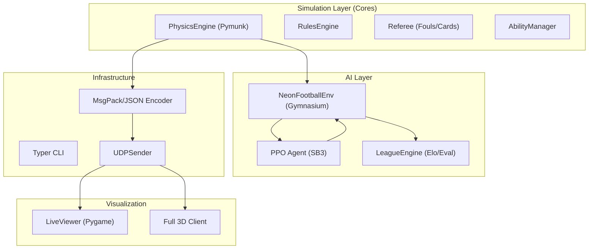

# Neon Gridiron ULTRA: Architecture & Dataflow

This document describes the high-fidelity architecture of the Neon Gridiron ULTRA AI research platform.

## System Overview

Neon Gridiron ULTRA is designed for **Multi-Agent Reinforcement Learning (MARL)** research in a fast-paced, deterministic soccer simulation.

## Dataflow

1.  **Physics Step**: The `PhysicsEngine` advances the world by `dt=1/60s`.
2.  **State Extraction**: `MatchState` snapshots are created from Pymunk bodies.
3.  **Gym Step**: The `NeonFootballEnv` converts the state into a normalized observation vector (64 floats).
4.  **Agent Action**: The RL policy predicts 28 forces (7 agents x 4 actions).
5.  **Force Application**: The environment maps agent actions back to physical impulses in the `PhysicsEngine`.
6.  **Telemetry Broadcast**: `UDPSender` broadcasts the encoded `MatchState` to visualizers.

## Determinism Policy

Neon Gridiron ULTRA enforces bit-identical reproducibility through:
-   **Fixed Time Step**: `self.space.step(1/60)`.
-   **Seeded RNG**: Centralized `DeterministicRNG` class powered by `numpy.random.Generator`.
-   **Traceable Initialization**: All components receive the root seed via configuration.
