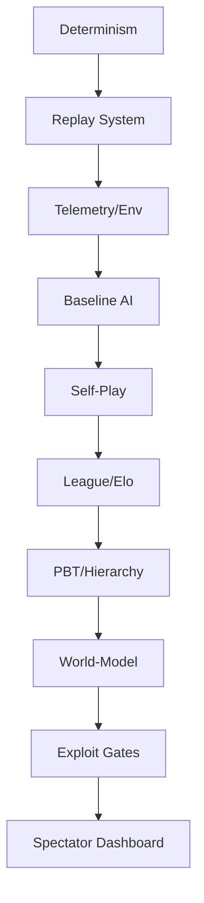

# Neon Gridiron: ULTRA Implementation Plan 🏆🤖⚡

## Executive Summary
This document outlines the engineering roadmap for **Neon Gridiron ULTRA**, a production-grade MARL football simulation. We move beyond simple self-play into a multi-tiered hierarchy of AI agents, robust anti-exploit frameworks, and a high-fidelity visualization stack.

## 1. Project Management & RACI
- **PM/Producer**: Milestone tracking, LiveOps coordination.
- **Lead Gameplay/Physics**: Deterministic core, Magnus effect, referee logic.
- **Lead AI/ML**: MARL hierarchy, PBT, World-Model integration.
- **DevOps/Infra**: Dockerized training fleet, CI/CD gates.
- **UI/Viz Lead**: Next.js Dashboard, Replay UI, Explainability Feed.

## 2. Workstreams (Sprints 1-24)

### WS1: Core & Determinism (Sprints 1-3)
- Refactor Pymunk core for absolute bit-perfect determinism.
- Implement keyframe-based replay serialization.
- **DoD**: 1000 matches with identical seeds yield identical hashes.

### WS2: Referee & Rules (Sprints 2-4)
- Formalize "Penalty Points" and VAR system.
- Implement offside line detection and advantage rules.

### WS3: MARL Hierarchy (Sprints 4-8) [CRITICAL]
- **Coach Policy**: High-level intent distribution.
- **Player Policy**: Intent-conditioned execution.
- **DoD**: Team demonstrates coordinated "Pressing" or "Park the Bus" behavior based on Coach intents.

### WS4: World-Model & Planning (Sprints 6-10)
- Auxiliary task: Predict next 30 ticks of ball/player movement.
- Foul Risk Prediction head.
- Integration into policy as a value-shaping mechanism.

### WS5: League & PBT (Sprints 5-12)
- Matchmaking via Elo/Glicko.
- Mutation operators for reward weights and ability preferences.
- Automated "Hall of Fame" checkpointing.

### WS6: Telemetry & Analytics (Sprints 3-6)
- High-frequency metrics (xG, Spectacle, Discipline).
- Explainability logging (Reason Codes).

### WS7: Server & Real-time Stream (Sprints 7-10)
- FastAPI + WebSockets for live visualization.
- SQLite/Postgres persistence layer.

### WS8: Next.js Dashboard (Sprints 8-14)
- Replay Viewer with timeline events.
- Generation Explorer (Heatmaps/Elo).

### WS9: Anti-Exploit Lab (Sprints 10-15)
- Detector suite for 25+ common RL exploits.
- Automated "Heat" penalty system.

### WS10: Sound & Atmosphere (Sprints 14-18)
- Dynamic audio engine based on game events.

### WS11: CI/CD & Production (Sprints 1-24)
- Automated eval-gates for every PR.

### WS12: LiveOps & Seasons (Post-Launch)
- Patch management and meta-tuning.

## 3. Critical Path

## 4. Risk Management
| Risk | Impact | Mitigation |
| :--- | :--- | :--- |
| Non-deterministic physics | High | Fixed-point math / Strict tick alignment. |
| Reward hacking (Exploits) | Med-High | WS9: Anti-Exploit Framework. |
| PBT Divergence | Med | Diversity metrics (Novelty Search) in selection. |
| Telemetry Bottleneck | Low | Binary serialization (Protobuf) if JSON is slow. |

## 6. Training Gates
| Metric | Threshold | Action |
| :--- | :--- | :--- |
| Win rate vs Baseline | >75% | Move to Phase: Advanced Abilities. |
| Foul Rate | >5% | Increase Penalty Weight / Rollback. |
| Spectacle Score | <2.0 | Mutation: Increase Aggression Bias. |

## 7. Definition of Done (DoD)
- Code passes ruff/mypy.
- Test coverage >85%.
- Determinism check passes.
- Replay for the match is valid and viewable in UI.
- Explainability logs contain non-empty Reason Codes.
# lines: 110
